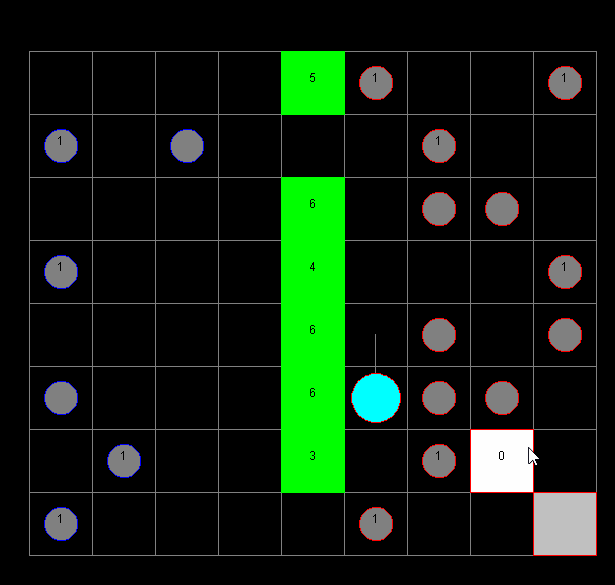

# MicroRTS BOT

In this project,  I was tasked to create a bot for the real-time strategy game called MicroRTS. MicroRTS is written in Java and the way in which user bots were integrated meant the bots had to be written in Java also. The bot I wrote used a two-layered Monte Carlo Tree Search algorithm it achieved a moderate amount of success when compared with the sample bots provided. One rule required the bots to make a move within 100ms. The algorithm I wrote gave back better results the more time it had to run, I found optimising the algorithm often resulted in a large improvement in performance. I often found it frustrating to determine whether or not changes made to the bot actually improved the performance of the bot.

